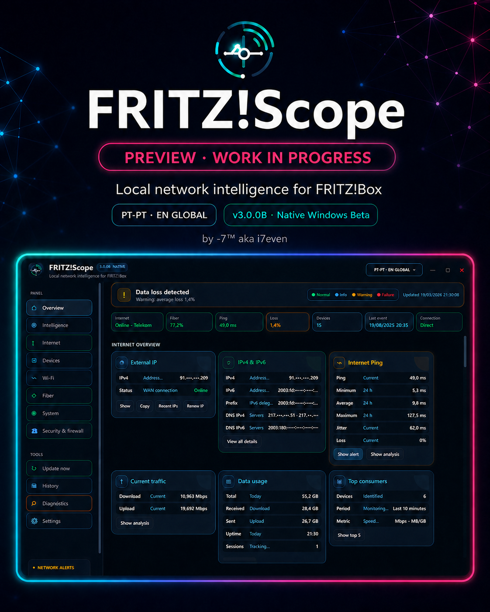
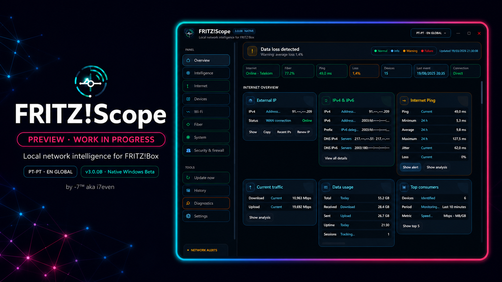
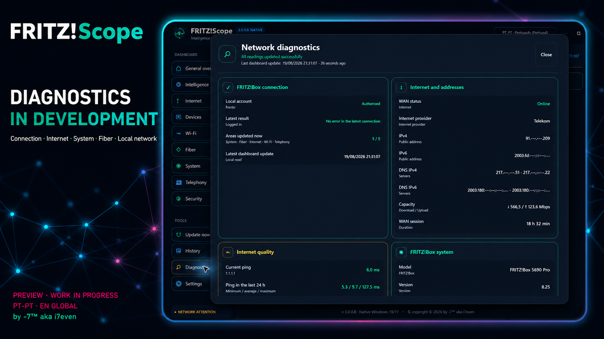
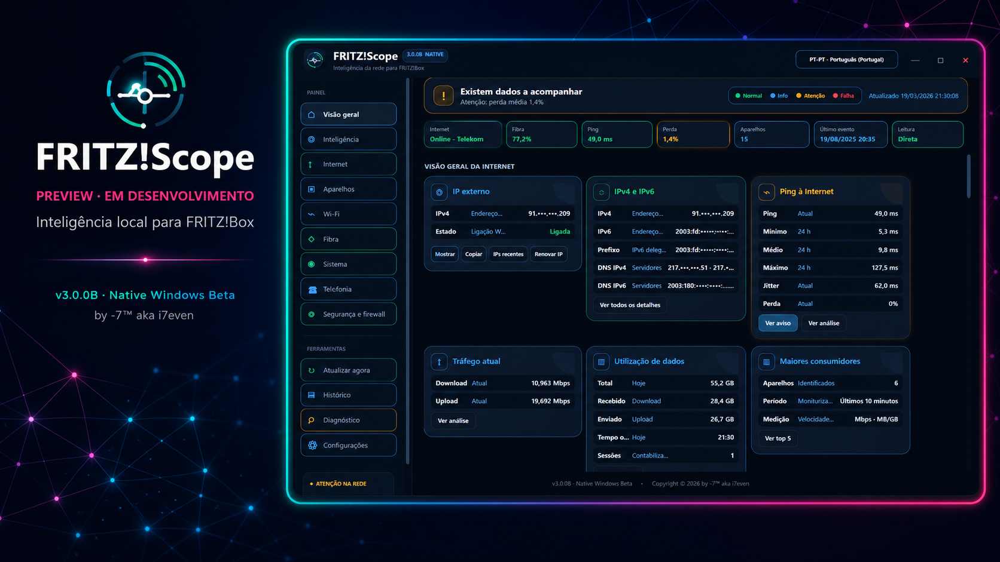
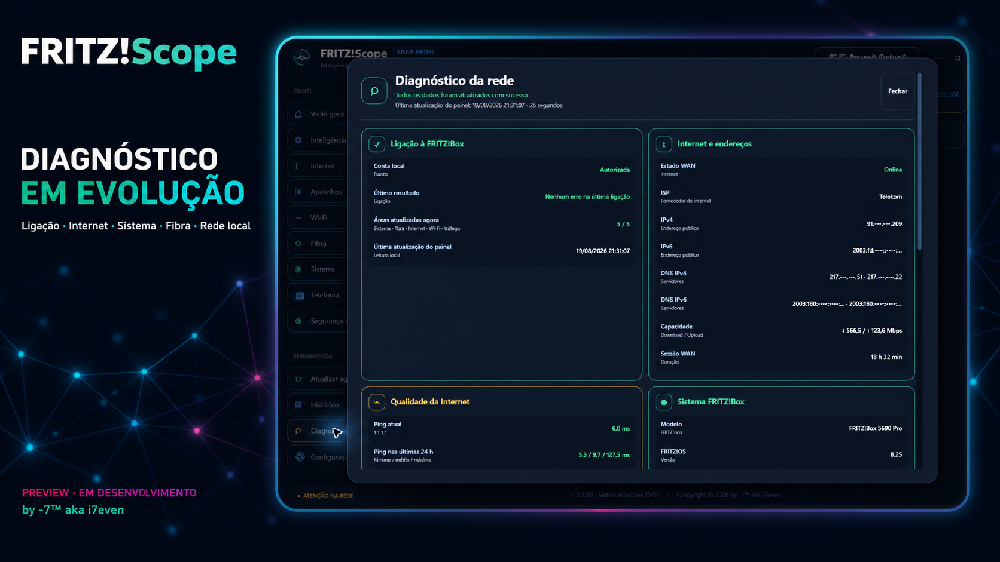

# FRITZ!Scope

**Visual preview · Work in progress**  
**Pré-visualização visual · Em desenvolvimento**

Local Windows network intelligence for FRITZ!Box  
Inteligência local de rede para FRITZ!Box

`v3.0.0B` · `Native Windows Beta` · `PT-PT` · `EN Global`

> [!IMPORTANT]
> This repository is a visual showcase only. The application, source code, executable and downloads are not published yet because development and validation are still in progress.

> [!IMPORTANT]
> Este repositório é apenas uma apresentação visual. A aplicação, o código-fonte, o executável e os downloads ainda não são publicados porque o desenvolvimento e a validação continuam em curso.

## EN Global preview

## Pré-visualização PT-PT

## Current public status · Estado público atual

- Visual preview only · Apenas apresentação visual
- Native Windows interface under active development · Interface nativa para Windows em desenvolvimento ativo
- PT-PT and EN Global interface · Interface PT-PT e EN Global
- No public executable or source-code download · Sem download público do executável ou código-fonte
- Screenshots use masked network addresses · Os endereços de rede estão ocultos nas imagens
- No credentials, router logs, history or private configuration are included · Não são incluídos credenciais, registos do router, histórico ou configurações privadas

## Trademark and temporary-name notice · Aviso de marcas e nome provisório

### EN Global

FRITZ! and FRITZ!Box are trademarks of **FRITZ! GmbH**. This independent project does not claim ownership of, or any rights in, those trademarks and is not affiliated with, endorsed by, sponsored by or connected to FRITZ! GmbH.

**“FRITZ!Scope” is only a temporary working title used privately by the project creator during development.** Its appearance in this visual preview does not constitute a public release of the application under that name or the adoption of the name as a commercial brand. The application name and visual identity may be changed before any future public release to avoid confusion and to respect third-party trademark and intellectual-property rights.

Official trademark and usage information: [FRITZ! GmbH — Terms of Use](https://about.fritz.com/en/press/images-and-videos/terms-of-use).

### PT-PT

FRITZ! e FRITZ!Box são marcas da **FRITZ! GmbH**. Este projeto independente não reivindica a propriedade dessas marcas nem quaisquer direitos sobre elas e não é afiliado, aprovado, patrocinado nem associado à FRITZ! GmbH.

**“FRITZ!Scope” é apenas um nome de trabalho provisório, utilizado de forma privada pelo criador do projeto durante o desenvolvimento.** A sua apresentação nesta pré-visualização não constitui o lançamento público da aplicação com esse nome nem a adoção do nome como marca comercial. O nome da aplicação e a respetiva identidade visual poderão ser alterados antes de qualquer futuro lançamento público, para evitar confusão e respeitar os direitos de marca e de propriedade intelectual de terceiros.

Informação oficial sobre as marcas e respetivas condições de utilização: [FRITZ! GmbH — Condições de utilização](https://about.fritz.com/presse/bilder-und-videos/nutzungsbedingungen).

© 2026 by **-7™ aka i7even** · All rights reserved

