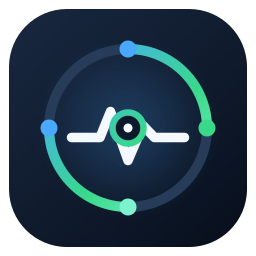
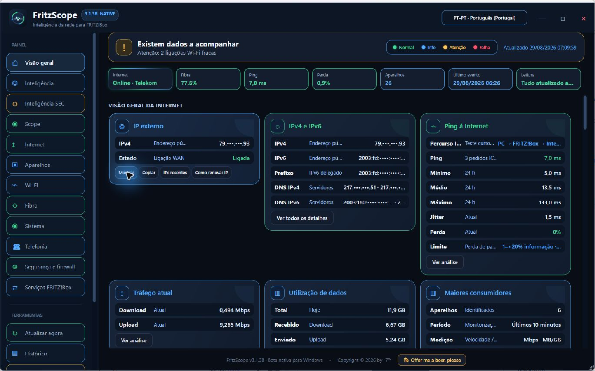
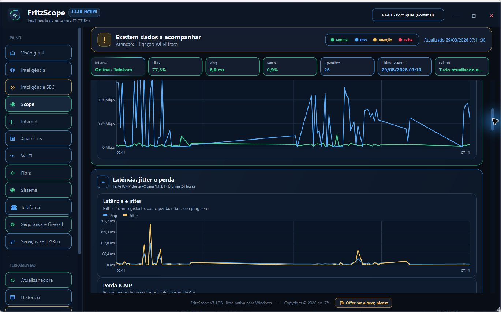

# FritzScope

  
  
  
  
  
  
  
  

**Native Windows public beta · Binary release** 
**Beta pública nativa para Windows · Distribuição binária**

Local Windows network intelligence for FRITZ!Box  
Inteligência local de rede para FRITZ!Box

`v3.1.3B` · `Native Windows Beta` · `PT-PT` · `EN Global` · `DE planned · geplant`

> [!IMPORTANT]
> This repository publishes the **compiled Windows beta only**. The application source code is not included. The release package contains the executable, the project-owned icons and user documentation; it contains no router credentials, logs, histories, backups or private configuration.

> [!IMPORTANT]
> Este repositório publica apenas a **beta compilada para Windows**. O código-fonte da aplicação não é incluído. O pacote contém o executável, os ícones próprios do projeto e documentação; não contém credenciais do router, registos, históricos, cópias de segurança nem configuração privada.

> [!WARNING]
> `v3.1.3B` is an unsigned beta. Windows SmartScreen may display an “unknown publisher” warning. Download only from this repository and compare the SHA-256 checksum shown in the release notes before running it.

> [!WARNING]
> A `v3.1.3B` é uma beta sem assinatura digital. O Windows SmartScreen poderá mostrar o aviso “editor desconhecido”. Transfere apenas deste repositório e confirma o SHA-256 indicado nas notas da versão antes de executar.

## Download · Transferência

- **Requirements · Requisitos:** Windows 10 or Windows 11 with .NET Framework 4.8; a reachable FRITZ!Box and an authorised local account.
- **Fastest download · Transferência mais rápida:** download [`FritzScope-v3.1.3B-Windows.exe`](https://github.com/i7even/FRITZScope-preview/releases/download/v3.1.3B/FritzScope-v3.1.3B-Windows.exe) and run it directly.
- **Recommended complete package · Pacote completo recomendado:** download [`FritzScope-v3.1.3B-Native-Windows.zip`](https://github.com/i7even/FRITZScope-preview/releases/download/v3.1.3B/FritzScope-v3.1.3B-Native-Windows.zip), extract it and run `FritzScope.exe`; this package also includes the licence, notices and local documentation.
- **Visible download guide · Guia visível:** [`DOWNLOAD.md`](DOWNLOAD.md).
- **No installer · Sem instalador:** both downloads contain the same portable executable; no installation wizard is required.
- **No application source in the repository · Sem fontes da aplicação no repositório:** GitHub's automatically generated “Source code” archives contain only the public repository files (`.gitignore`, README, licence, notices and project icon)—not the application's source code.
- **Reverse-engineering limitation · Limite de proteção:** omitting the source files does not make a .NET executable impossible to analyse or decompile. This beta is distributed without source code, but it must not be treated as technically immune to reverse engineering.
- **Optional support · Apoio opcional:** donations are voluntary, one-time and do not unlock features.
- **Policies · Políticas:** [binary licence](LICENSE.md) · [privacy notice](PRIVACY.md) · [third-party notices](THIRD-PARTY-NOTICES.md) · [asset provenance](ASSET-PROVENANCE.md).

## Why this project exists · Porque existe este projeto · Warum dieses Projekt entstanden ist

### 🇵🇹 Porque existe este projeto

Este projeto nasceu de um objetivo simples: criar um painel local rápido, prático e informativo, capaz de mostrar o estado da rede sem obrigar o utilizador a percorrer toda a interface da FRITZ!Box para encontrar cada detalhe.

Durante sucessivos ciclos de desenvolvimento e testes, e ao explorar as abordagens já disponíveis, algumas das soluções analisadas pareciam exigir códigos, tokens ou componentes obtidos noutros locais, a ligação manual de várias peças e a resolução de erros provocados por informação ou contexto em falta. Outras recorriam a subscrições, níveis pagos dispendiosos ou limites de utilização mesmo para tarefas básicas de monitorização.

O FritzScope procura tornar tudo isso mais direto: abrir o painel, perceber imediatamente o que está a acontecer e aprofundar apenas os detalhes necessários — sem configurações desnecessárias.

A beta pública é disponibilizada gratuitamente, com a possibilidade de apoio ou donativo único e totalmente opcional. Não está planeada qualquer subscrição recorrente para as funcionalidades essenciais, e o donativo não desbloqueia funções nem cria uma licença diferente.

**Princípios do projeto:**

- Funcionamento local e privacidade em primeiro lugar;
- Explicações claras em vez de dados técnicos sem contexto;
- Configuração mínima e opções predefinidas realmente úteis;
- Monitorização essencial incluída na aplicação principal;
- Limitações explicadas com honestidade e fontes de dados identificadas;
- Sem funcionalidades essenciais bloqueadas por uma subscrição mensal.

> **O compromisso é simples:** tornar a monitorização da rede prática, compreensível e útil, sem complicações artificiais.

---

### 🇬🇧 Why this project exists

This project started with a simple goal: to create a fast, practical and informative local dashboard that shows the state of the network without requiring users to navigate the entire FRITZ!Box interface to find each detail.

Through repeated development and testing cycles, and while exploring the approaches already available, some of the solutions I examined appeared to require obtaining codes, tokens or separate components elsewhere, manually connecting several pieces, and troubleshooting errors caused by missing information or context. Others relied on subscriptions, expensive feature tiers or usage limits even for basic monitoring tasks.

FritzScope aims to make that experience more direct: open the dashboard, understand what is happening immediately, and explore the details only when they are needed — without unnecessary configuration.

The public beta is available free of charge, with completely optional one-time support or donations. No recurring subscription is planned for essential features, and a donation does not unlock features or create a different licence tier.

**Project principles:**

- Local-first operation and privacy;
- Clear explanations instead of raw technical jargon;
- Minimal configuration and genuinely useful defaults;
- Essential monitoring included in the core application;
- Honest limitations and clearly identified data sources;
- No essential features locked behind a monthly subscription.

> **The commitment is simple:** make network monitoring practical, understandable and useful, without artificial complexity.

---

### 🇩🇪 Warum dieses Projekt entstanden ist

Dieses Projekt entstand aus einem einfachen Ziel: ein schnelles, praktisches und informatives lokales Dashboard zu entwickeln, das den Zustand des Netzwerks übersichtlich darstellt, ohne dass alle Bereiche der FRITZ!Box-Benutzeroberfläche einzeln durchsucht werden müssen.

Im Verlauf wiederholter Entwicklungs- und Testzyklen sowie bei der Prüfung bereits verfügbarer Ansätze zeigte sich, dass einige der untersuchten Lösungen Codes, Tokens oder einzelne Komponenten aus verschiedenen Quellen zu erfordern schienen. Anschließend mussten mehrere Teile manuell miteinander verbunden und Fehler behoben werden, die durch fehlende Informationen oder fehlenden Kontext entstanden. Andere Lösungen setzten selbst bei grundlegenden Überwachungsaufgaben auf Abonnements, teure Funktionsstufen oder Nutzungslimits.

FritzScope soll diesen Ablauf vereinfachen: Dashboard öffnen, den aktuellen Zustand sofort verstehen und nur bei Bedarf weitere Details aufrufen — ohne unnötige Konfiguration.

Die öffentliche Beta wird kostenlos angeboten; eine freiwillige einmalige Unterstützung oder Spende ist möglich. Für wesentliche Funktionen ist kein wiederkehrendes Abonnement vorgesehen, und eine Spende schaltet keine Funktionen oder andere Lizenzstufe frei.

**Grundsätze des Projekts:**

- Lokale Verarbeitung und Datenschutz an erster Stelle;
- Klare Erklärungen statt unaufbereiteter Fachbegriffe;
- Möglichst wenig Konfiguration und sinnvolle Voreinstellungen;
- Wesentliche Überwachungsfunktionen als Teil der Kernanwendung;
- Ehrlich kommunizierte Grenzen und klar angegebene Datenquellen;
- Keine wesentlichen Funktionen hinter einem monatlichen Abonnement.

> **Das Versprechen ist einfach:** Netzwerküberwachung soll praktisch, verständlich und nützlich sein — ohne künstliche Komplexität.

## Screenshots · Imagens

### Overview · Visão geral

Current product capture showing the native Windows overview. Public and local network addresses were masked with the application's built-in privacy control before capture.

Captura atual da aplicação, mostrando a visão geral nativa para Windows. Os endereços de rede públicos e locais foram ocultados através do controlo de privacidade da própria aplicação antes da captura.

### Scope charts · Gráficos do Scope

Current product capture showing local traffic, latency and jitter history. The selected view contains no IP addresses, MAC addresses, device names, SSIDs, phone numbers, credentials or personal logs.

Captura atual da aplicação, mostrando o histórico local de tráfego, latência e jitter. A vista selecionada não contém endereços IP ou MAC, nomes de aparelhos, SSIDs, números de telefone, credenciais ou registos pessoais.

## Current public status · Estado público atual

- Native Windows public beta v3.1.3B · Beta pública nativa para Windows v3.1.3B
- Compiled binary package available; application source code is not published · Pacote binário compilado disponível; o código-fonte da aplicação não é publicado
- PT-PT and EN Global interface; German planned · Interface PT-PT e EN Global; alemão planeado
- Unsigned beta; SHA-256 is published with the release · Beta sem assinatura digital; o SHA-256 é publicado com a versão
- Published screenshots use masked or non-identifying network data · As imagens publicadas utilizam dados de rede ocultos ou não identificáveis
- No credentials, router logs, history or private configuration are included · Não são incluídos credenciais, registos do router, histórico ou configurações privadas

## Privacy and measurement boundaries · Privacidade e limites das medições

The following describes the current public beta. The compiled executable is distributed without application source code.

- The current ICMP test targets `1.1.1.1`. Its response rate describes only that local test and is not a formal ISP SLA or WAN-availability measurement.
- Direct TR-064 readings can use unencrypted HTTP, but only between the Windows computer and the FRITZ!Box inside the local network. A credential saved at rest is encrypted for the current Windows user with DPAPI.
- Device arrival and departure history can contain a device name, local IP address and MAC address. It remains on the computer and is retained for no more than 30 days.
- Scope's numeric history remains local and stores no device names, IP addresses, MAC addresses, SSIDs or credentials.
- **Identify** contacts the maclookup service only after the user invokes it. It sends only the first three bytes of the MAC address (the OUI), never the complete MAC address, and caches the returned vendor locally.
- **Search online** is a separate manual action that opens the default browser with a Google search containing only that OUI prefix and the words used to identify a MAC manufacturer.
- In **Security and firewall**, locating an external IP is always a manual, confirmed action. Only the selected public IP is sent first to api.ipapi.is; if that service returns no usable result, ipwho.is can be used as a fallback. The result is kept in memory for the current run.

O texto seguinte descreve a beta pública atual. O executável compilado é distribuído sem o código-fonte da aplicação.

- O teste ICMP atual usa `1.1.1.1` como alvo. A percentagem de respostas descreve apenas esse teste local e não constitui uma medição formal de SLA ou disponibilidade WAN do operador.
- As leituras diretas TR-064 podem usar HTTP sem encriptação, mas apenas entre o computador Windows e a FRITZ!Box dentro da rede local. Uma credencial guardada em repouso é encriptada com o DPAPI para o utilizador atual do Windows.
- O histórico de entradas e saídas dos aparelhos pode conter o nome, o IP local e o endereço MAC. Permanece no computador e é conservado durante um máximo de 30 dias.
- O histórico numérico do Scope permanece local e não guarda nomes de aparelhos, IPs, MACs, SSIDs nem credenciais.
- **Identificar** só consulta o serviço maclookup depois de ser escolhido pelo utilizador. Envia apenas os primeiros três bytes do MAC (OUI), nunca o endereço MAC completo, e guarda localmente em cache o fabricante obtido.
- **Pesquisar online** é uma ação manual separada que abre o navegador predefinido com uma pesquisa Google contendo apenas esse prefixo OUI e os termos usados para identificar o fabricante do MAC.
- Em **Segurança e firewall**, localizar um IP externo é sempre uma ação manual e confirmada. Só o IP público selecionado é enviado primeiro para api.ipapi.is; se esse serviço não devolver um resultado utilizável, ipwho.is pode ser usado como alternativa. O resultado permanece em memória durante a execução atual.

## Roadmap and ideas under evaluation · Roteiro e ideias em avaliação · Roadmap und Ideen in Prüfung

### Português — PT-PT

#### Interface em alemão

Está prevista uma interface em alemão para uma versão futura. Como vivo na Alemanha, mas ainda estou a aprender alemão, vou rever cuidadosamente todos os textos alemães antes de qualquer lançamento. O objetivo é apresentar uma tradução natural, clara e tão correta quanto possível — não uma tradução automática publicada à pressa.

#### Funcionalidades em avaliação

- Mapa gráfico da rede e visualização da topologia, das rotas e do rastreio IP (`traceroute`);
- Temperatura interior/ambiente e temperatura exterior;
- Integração de dados meteorológicos;
- Deteção e associação de routers secundários, repetidores, pontos de acesso, extensores e nós mesh;
- Painel de controlo para dispositivos de casa inteligente;
- Integração com o Home Assistant;
- Possíveis integrações com o Google Assistant e a Amazon Alexa.

Estas funcionalidades são apenas ideias em avaliação: ainda não estão implementadas nem são garantidas. Qualquer implementação dependerá de uma análise de viabilidade técnica, privacidade e segurança. As integrações meteorológicas, de casa inteligente e com assistentes de voz poderão exigir contas de fornecedor, serviços cloud, APIs oficiais, permissões do utilizador e o cumprimento das respetivas condições de utilização.

---

### English — Global

#### German-language interface

A German-language interface is planned for a future release. I live in Germany but I am still learning German, so I will carefully review all German text before publication. The aim is to provide natural, clear and accurate wording rather than publishing a rushed machine translation.

#### Features under evaluation

- A graphical network map with topology, route and IP-trace (`traceroute`) visualisation;
- Indoor or ambient temperature and outdoor temperature;
- Weather-data integration;
- Detection and association of secondary routers, repeaters, access points, extenders and mesh nodes;
- A smart-home device dashboard;
- Home Assistant integration;
- Possible Google Assistant and Amazon Alexa integrations.

These features are ideas under evaluation only: they are not currently implemented or guaranteed. Any implementation will depend on technical feasibility, privacy and security reviews. Weather, smart-home and voice-assistant integrations may require vendor accounts, cloud services, official APIs, user permissions and compliance with the relevant terms of service.

---

### Deutsch — Deutschland

#### Deutsche Benutzeroberfläche

Eine deutsche Benutzeroberfläche ist für eine zukünftige Version geplant. Ich lebe in Deutschland, lerne aber noch Deutsch. Deshalb werde ich alle deutschen Texte vor einer Veröffentlichung sorgfältig sprachlich prüfen. Ziel ist eine natürliche, klare und möglichst fehlerfreie Fassung – keine hastig veröffentlichte Maschinenübersetzung.

#### Funktionen in Prüfung

- Eine grafische Netzwerkkarte mit Darstellung der Topologie, Netzwerkpfade und IP-Traces (`Traceroute`);
- Innen- beziehungsweise Raumtemperatur und Außentemperatur;
- Integration von Wetterdaten;
- Erkennung und Zuordnung zusätzlicher Router, Repeater, Access Points, Extender und Mesh-Knoten;
- Ein Smart-Home-Dashboard;
- Integration mit Home Assistant;
- Mögliche Integrationen mit Google Assistant und Amazon Alexa.

Diese Funktionsideen werden derzeit nur geprüft; sie sind noch nicht implementiert und nicht verbindlich zugesagt. Eine mögliche Umsetzung setzt eine Prüfung der technischen Machbarkeit sowie des Datenschutzes und der Sicherheit voraus. Wetterdienste, Smart-Home-Systeme und Sprachassistenten können Herstellerkonten, Cloud-Dienste, offizielle APIs, Benutzerberechtigungen und die Einhaltung der jeweiligen Nutzungsbedingungen erfordern.

## Trademark and temporary-name notice · Aviso de marcas e nome provisório · Hinweis zu Marken und zum vorläufigen Projektnamen

### EN Global

FRITZ! and FRITZ!Box are trademarks of **FRITZ! GmbH**. This independent project does not claim ownership of, or any rights in, those trademarks and is not affiliated with, endorsed by, sponsored by or connected to FRITZ! GmbH.

**“FritzScope” is a temporary project name used by its independent creator for this beta.** Publication under this name does not imply authorisation, affiliation, sponsorship or endorsement by FRITZ! GmbH. The name and visual identity may change in a future release to reduce confusion and respect third-party trademark and intellectual-property rights.

Official trademark and usage information: [FRITZ! GmbH — Terms of Use](https://about.fritz.com/en/press/images-and-videos/terms-of-use).

### PT-PT

FRITZ! e FRITZ!Box são marcas da **FRITZ! GmbH**. Este projeto independente não reivindica a propriedade dessas marcas nem quaisquer direitos sobre elas e não é afiliado, aprovado, patrocinado nem associado à FRITZ! GmbH.

**“FritzScope” é um nome provisório utilizado pelo seu criador independente nesta beta.** A publicação com este nome não implica autorização, afiliação, patrocínio nem aprovação pela FRITZ! GmbH. O nome e a identidade visual poderão mudar numa versão futura para reduzir qualquer confusão e respeitar direitos de marca e de propriedade intelectual de terceiros.

Informação oficial sobre as marcas e respetivas condições de utilização: [FRITZ! GmbH — Condições de utilização](https://about.fritz.com/presse/bilder-und-videos/nutzungsbedingungen).

### DE — Deutschland

FRITZ! und FRITZ!Box sind Marken der **FRITZ! GmbH**. Dieses unabhängige Projekt beansprucht weder die Inhaberschaft noch sonstige Rechte an diesen Marken. Es steht in keiner Verbindung zur FRITZ! GmbH, wurde von ihr weder autorisiert noch unterstützt und wird von ihr nicht gesponsert.

**„FritzScope“ ist ein vorläufiger Projektname, den der unabhängige Entwickler für diese Beta verwendet.** Die Veröffentlichung unter diesem Namen bedeutet keine Genehmigung, Verbindung, Förderung oder Unterstützung durch die FRITZ! GmbH. Name und visuelle Identität können in einer späteren Version geändert werden, um Verwechslungen zu verringern und Markenrechte sowie sonstige Rechte Dritter zu respektieren.

Offizielle Informationen zu Marken und deren Nutzung: [FRITZ! GmbH — Nutzungsbedingungen](https://about.fritz.com/presse/bilder-und-videos/nutzungsbedingungen).

© 2026 by **-7™** · All rights reserved

